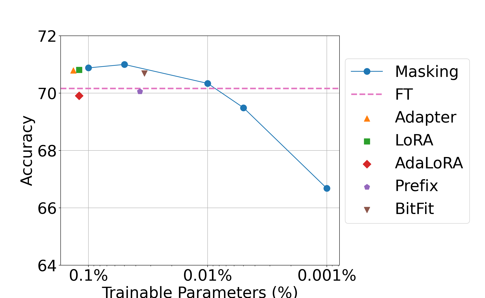

## Random Masking Finds Winning Tickets for Parameter Efficient Fine-tuning

This repository contains the code for the paper *Random Masking Finds Winning Tickets for Parameter Efficient Fine-tuning*. 
The implementation is based on the code of [MeZO](https://github.com/princeton-nlp/MeZO/tree/main).

The implementation of Random Masking can be found in PEFT/random_masking.py. This implementation depends on the [spops library](https://github.com/IST-DASLab/spops/tree/main) to perform the sparse matrix operations. 
We also provide a naive version of Random Masking in PEFT/random_masking_naive.py, which directly stores the mask and tunable parameters in dense matrices.

### Example command:

Run Random Masking on RTE dataset using OPT-1.3b, with tunable parameter ratio 0.01%(masking probability 0.9999) and learning rate 1e-2:
```
MODEL=facebook/opt-1.3b TASK=RTE EPOCH=5 MODE=random_masking LR=1e-2 MASKING_PROB=0.9999 LOCAL_HOST=0 SEED=0 bash run.sh
```

### Results



*The average performance of PEFT methods over various numbers of trainable parameters. Despite its simple design, Random Masking achieves competitive performance with fewer trainable parameters.*


